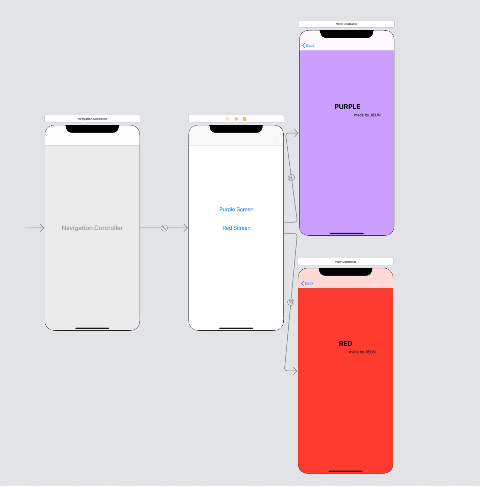
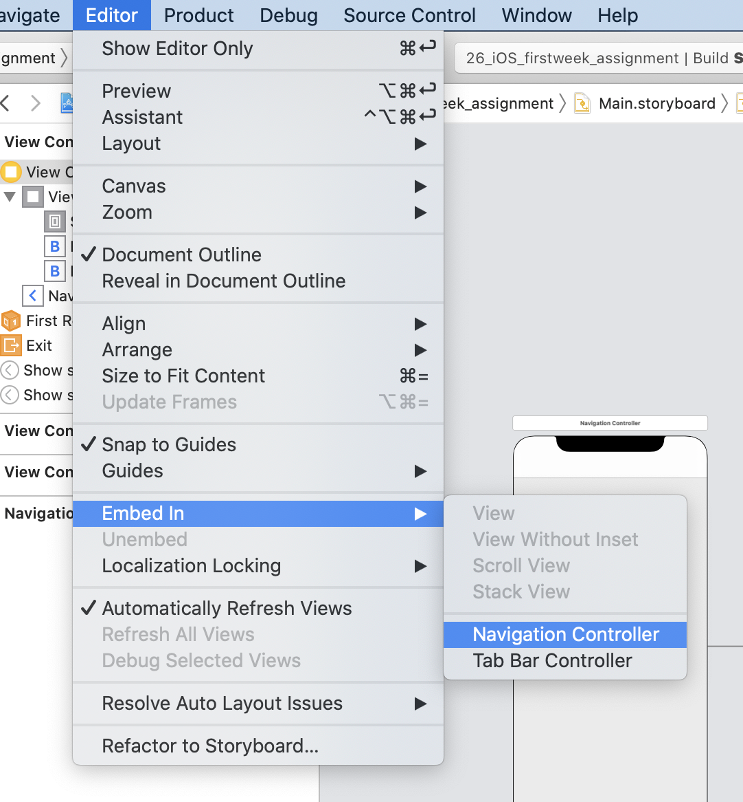
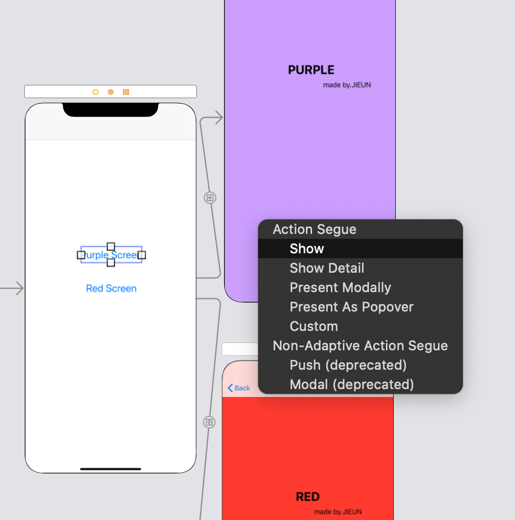

# 1️⃣주차 과제📚🍎

### ✅ 목차 ✅

- 1-1) Navigation 활용 화면 이동
- 1-2) 로그인 화면 구현

-----------

## 1. Navigation 활용 화면이동

- #### 전체 화면 구성

  

- #### 구현방법

> ***==> 코드 사용 ❌***
>
> #### 1️⃣ 먼저 <u>"Editor -> Embed in -> navigation controller"</u> 로 navigation controller를 추가해준다. 
>
> 

> 
> 
> 

>
> 
>
>
> #### 2️⃣ Purple Screen, Red Screen 이라는 2개의 버튼을 생성해준다.
>
> 
>
> #### 3️⃣ 각 버튼을 "<u>ctrl+드래그</u>"해서 다음 뷰로 끌어다가 놓은 다음에 Action을 show segue로 연결해서 버튼을 클릭했을 때 다음 뷰로 이동하게 해준다.
>
> 

> 
> 

## 2. 로그인 화면 구현

