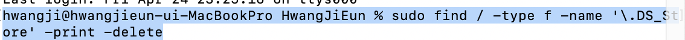

## .DS_store 지우는 방법

<div style="text-align:left;">
  
</div>

```
sudo find / -type f -name '\.DS_Store' -print -delete
```

- 터미널에서 자신의 git 폴더로 이동한 다음 위와 같은 코드를 써주고 엔터를 누르면 .DS_store파일이 지워진다.
- 이후 git push를 하면 git의 레파지토리 내에서도 .DS_store가 사라진 것을 볼 수 있다.

<br>

DS_store가 생기는 이유는 mac의 finder로 폴더에 접근하면 자동으로 생기는 파일로서, 해당 디렉토리의 특성, 구조 등에 관한 내용을 가지고 있는 파일이라 합니다.

 .DS_store이란 파일은 프로젝트와 관련없는 파일이고 git status를 사용했을 때 발견되는 파일이니 github로 넘기지말고 지우는게 좋을 것 같았습니다.