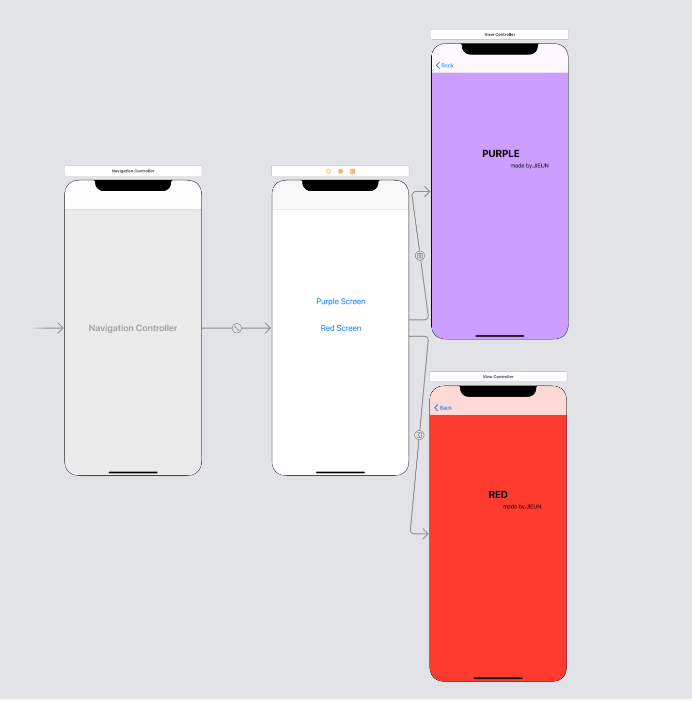
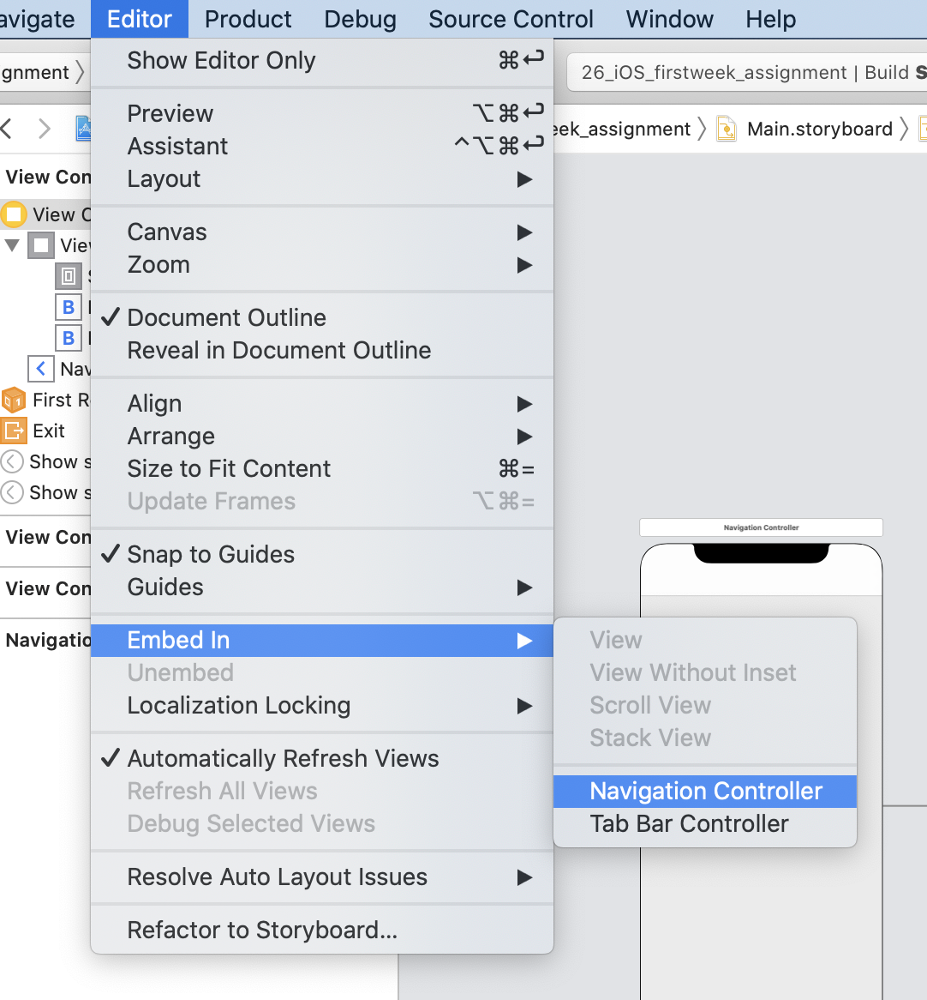
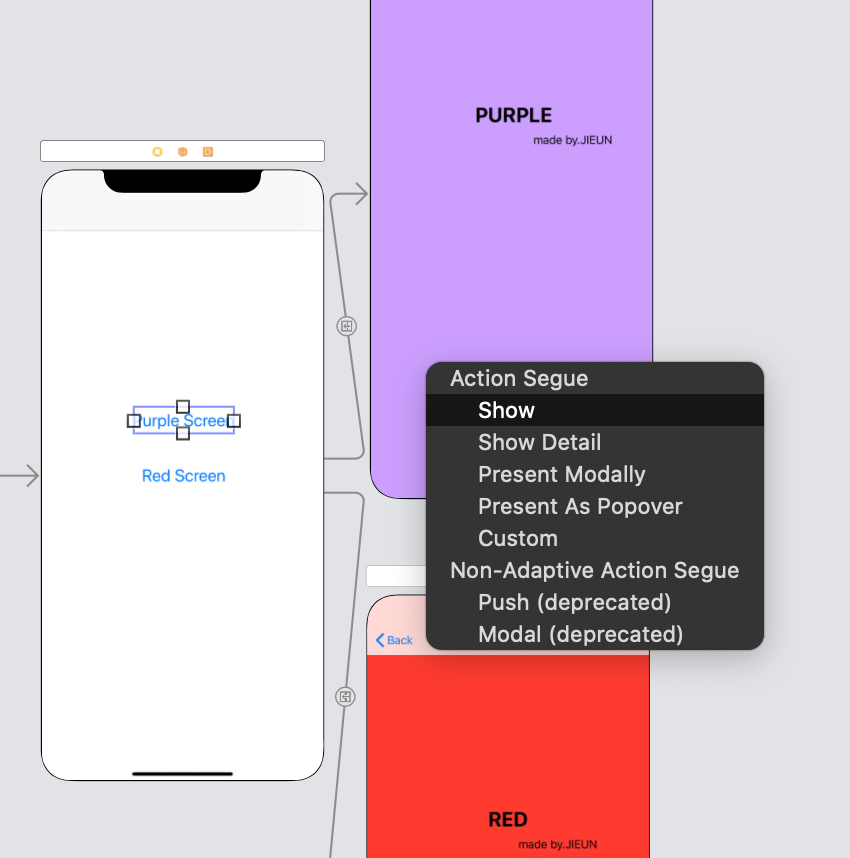
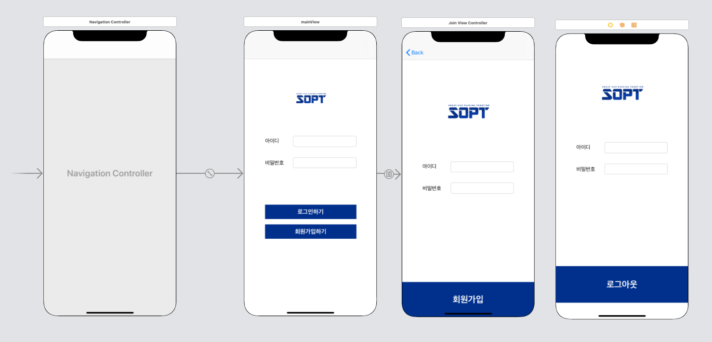

<br>

# 1️⃣주차 과제📚🍎

### ✅ 목차 ✅

- 1-1) [Navigation 활용 화면 이동](#1-navigation-활용-화면이동)
- 1-2) [로그인 화면 구현](#2-로그인-화면-구현)

-----------

<br>

## 1. Navigation 활용 화면이동

- ### 전체 화면 구성

<div style="text-align:left;">
  
</div>

<br>

- ### 구현방법

> #### ***❌ 코드 사용 ❌***
>
> #### 1️⃣ **먼저** <u>"Editor -> Embed in -> navigation controller"</u> 로 navigation controller를 추가한다. 
>
> <div style="text-align:left;">
> 
> 
> </div>
>
> 
>
>
> #### 2️⃣ Purple Screen, Red Screen 이라는 2개의 버튼을 생성한다.
>
> <br>
>
> #### 3️⃣ 각 버튼을 "<u>ctrl+드래그</u>"해서 다음 뷰로 끌어다가 놓은 다음에 Action을 show segue로 연결해서 버튼을 클릭했을 때 다음 뷰로 이동하게 한다.
>
> <div style="text-align:left;">
> 
> </div>

<br>

<br>

<br>

## 2. 로그인 화면 구현

#### ‼️ 이번 과제에서 중요한 것 ‼️

👉🏻 <u>화면 간 데이터 전달하기 & dismiss해서 rootViewController로 돌아가기</u> 

<br>

- ### 전체 화면 구성

<div style="text-align:left;">
  
</div>

<br>

- ### 구현 방법

### 1️⃣  push로 화면 연결하는 방법

> - ####  메인 뷰의 회원가입하기 버튼을  ''<u>ctrl+ 드래그</u>'' 해서 회원가입 뷰로 끌어다 놓은 다음 Action을 push Segue로 연결해준다.
>
>   => 이렇게 되면 <u>메인 뷰에서 "회원가입하기 버튼"을 누르면 회원가입 뷰로 이동</u>되고, 이 두 뷰는 Navigation Controller로 연결된다
>
>   - 회원가입 뷰의 상단에 < Back 버튼이 생김!!!

<br>

<br>

### 2️⃣ 코드로 viewController 연결하는 방법

> - 연결할 뷰의 <u>**identifier를 설정**</u>해줘야 한다!! (중요 중요⭐️⭐️)
>   - 이 때,  다른 ViewController와 identifier가 겹치면 안된다.
>
> <br>
>
> - 그 예로 로그인 버튼과 로그인 뷰를 연결하는 코드 👇🏻
>
> -> present modally 로 연결된다
>
> ```swift
> @IBAction func loginBtn(_ sender: Any) {
>   
>         guard let receiveViewController = self.storyboard?.instantiateViewController(identifier: "loginView") as? LoginViewController else {return}
>         
>         self.present(receiveViewController, animated: true, completion: nil)
>  }
> ```

<br>

<br>

### 3️⃣ 화면 간 데이터 전달하는 방법

- 👇🏻그 예로 메인 화면과 로그인 화면의 데이터 전달 과정을 설명 

>1. #### 로그인 화면에 메인 화면으로부터 전달되는 값을 받기 위한 변수가 필요하기 때문에 로그인 뷰에 연결된 custom class 내에 변수를 선언해준다.
>
>   ```swift
>   var loginId:String?
>   var loginPw:String?
>   ```
>
>   <br>
>
>2. #### 메인 화면으로부터 받은 값을 로그인 화면의 변수에 할당해야 한다.
>
>   ```swift
>   private func setTextFields(){
>           guard let loginId = self.loginId else {return}
>           guard let loginPw = self.loginPw else {return}
>           
>           loginIdTextField.text = loginId
>           loginPwTextField.text = loginPw
>       }
>   ```
>
> - 바로 loginIdTextField.text = loginId으로 넣지 않은 이유는 Optional 값 때문이다. Optional이란 Swift 언어만의 특징인데, 값이 있을 수도 있고 없을 수도 있다는 뜻이다. 값이 없을 수도 있기때문에, Optional Binding을 통해 확인한 후 대입해주어야 한다. 즉, Optional Binding이 이를 확인하는 과정이라 할 수 있다.
>
>   <br>	
>
>3. ####  메인 화면에서 로그인화면으로 값을 넘겨주는 코드 작성.
>
>   -  view controller를 연결하는 코드도 포함되어 있다.
>
>   ```swift
>   @IBAction func loginBtn(_ sender: Any) {
>           guard let receiveViewController = self.storyboard?.instantiateViewController(identifier: "loginView") as? LoginViewController else {return}
>           
>           receiveViewController.loginId = idTextField.text //메인화면에서 로그인화면으로 값을 넘겨주는 코드
>           receiveViewController.loginPw = pwTextField.text //메인화면에서 로그인화면으로 값을 넘겨주는 코드
>           
>           self.present(receiveViewController, animated: true, completion: nil)
>           
>           self.idTextField.text = " " //로그아웃을 한 뒤 메인 화면의 텍스트필드에 입력했던 id가 남아있으면 로그아웃을 한 느낌이 나지 않으므로 눈속임으로 로그인 버튼을 누를 때 텍스트필드의 텍스트값을 지워주었다.
>           self.pwTextField.text = " "
>       }
>   ```

<br>

<br>

### 4️⃣ dismiss해서 rootViewController로 돌아가기</u>

>- #### **처음에 들었던 의문점** 😭
>
>  - 메인화면에서 아이디 비밀번호를 누른 후 로그인하기 버튼을 눌러서 로그인뷰로 가면 그 뷰가 modal형태로 뜬다. 그렇게 되면 로그아웃 버튼을 누를 때 dismiss를 해서 메인화면으로 돌아올 수 있다. ❗️그런데  <u>**회원가입하기 과정이 추가**</u>되었을 때 문제가 생기게 되었다.❗️
>
>    -  그 연결 과정이 "**메인 뷰** --(push로 연결)--> **회원가입 뷰** --(코드로 modal 연결)--> **로그인정보가 나타나는 뷰**" 이기 때문이었다. 
>
>      <br>
>
>  1. 뒤에 회원가입 뷰가 남아있는 상황에서 modal로 로그인 정보가 나타나는 뷰가 뜨게 된 상황에서 로그아웃 버튼을 눌러서 dismiss를 하게 되면 회원가입 뷰가 나타날 것이다.
>  2. 이 때, 메인화면과 회원가입 뷰는 '<u>**push segue**</u>'로 연결된 상태이기 때문에 dismiss를 해서는 이전 view(메인화면)로 돌아갈 수 없다.
>  3. 그럼 dismiss를 이용해서 push segue로 연결된 뷰를 어떻게 되돌릴 것이냐? 라는 고민을 하게 되었다.
>
><br>
>
><br>
>
>```swift
> guard let presentingVC = self.presentingViewController else { return }
>       
> let navigationController = presentingVC is UINavigationController ? presentingVC as? UINavigationController : presentingVC.navigationController
>      navigationController?.popToRootViewController(animated: false)
>
> self.dismiss(animated: true, completion: nil)
>```
>
>- 현재 presentingVC는 JoinViewController이다. 따라서 JoinViewController의 NavigationController내에서 pop(popToRootViewController)을 해서 presentingVC를 RootViewController(메인 뷰)로 되돌린다.
>  - dismiss가 실행되고 나면 자신을 호출한 뷰 컨트롤러가 나타나게 되는데, dismiss가 실행되기 전에 현재 로그아웃 뷰를 호출한 뷰 컨트롤러를 회원가입 뷰에서 메인 뷰로 되돌렸기 때문에 dismiss를 실행하고 나서 메인 뷰가 뜨게 된다.
>
><br>
>
><br>
>
>< 지식 나눔📚⭐️>
>
>- presentedViewController : 자신이 호출한 ViewController
>- presentingViewController: 자신을 호출한 ViewController

<br>

<br>